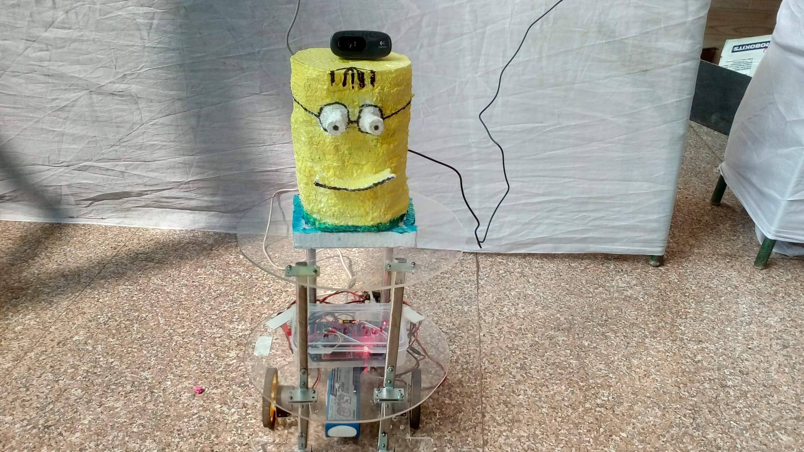

# FAIR minibot (First Autonomous Intelligent Robot)

The FAIR  robot is an indoor robot, specialized in traversing from one place to another autonomously.

The FAIR minobot is a helper robot for the FAIR robot. Thus its objective is to follow the FAIR robot to wherever it goes. Thus we started with a simple problem statement of following a particular shape, size and color of ball, to facilitate the main objective. 

The current algorithm uses openCV to detect the shape and color of the ball. As we are not using kinect for FAIR minibot, to reduce the computational cost. Hence we calculate relative depth of the ball after characterizing its properties using opencv, using its size. As we already know the fixed size of the ball.

The interface between the main code and arduino is done by using ROS.

## Demonstration

<b>Ball following Bot</b> 

<iframe width="600" height="350" src="https://www.youtube.com/embed/rxRCw2yRdNA" frameborder="0" allow="autoplay; encrypted-media" allowfullscreen align="center"></iframe>

