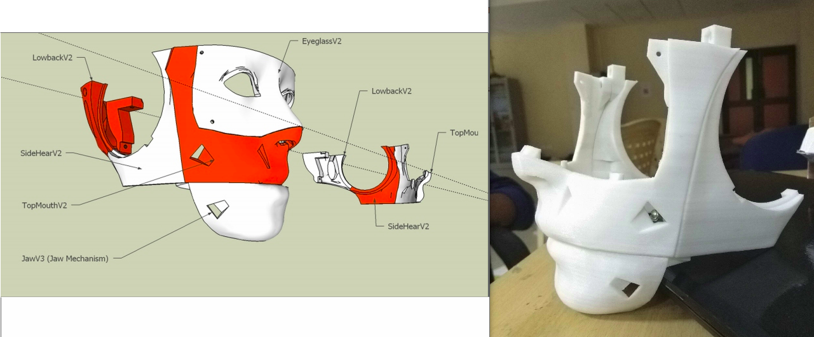
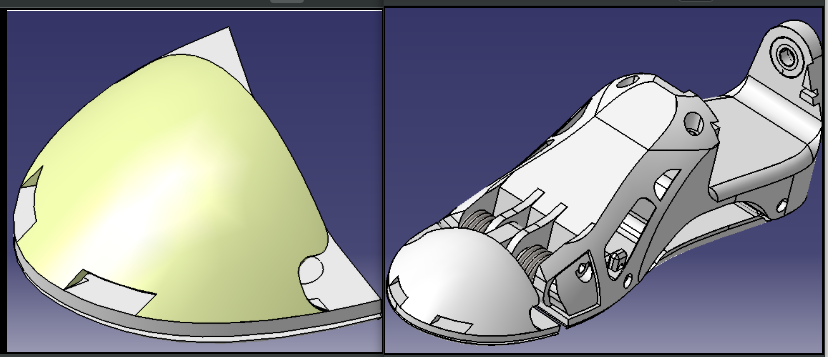

# Raman, The Humanoid

Project Raman is a powerful android robot being designed in the form of an adult human, with its body shape built to resemble the human body. Our objective is to explore and research the field of robotics to make facilitate robot's interaction and cooperation with humans.

Historically, androids remain completely within the domain of science fiction. 
Only recently have advancements in robot technology allowed the design of functional and realistic humanoid robots.
 Theoretically humanoids can perform any task a human being can, so long as they have the proper software. However, the complexity of doing so is immense. Hence we have a large team divided into sub-teams working on different problem statements, to come up with a humanoid which can perform numerous tasks.
 
In this project, I am currently leading the vision and conversational bot team since last year. It have been an amazing experience to work with a team with more than 40 members which includes under-grads as well as post-grads. I have learned a lot during this journey, from management skills to technical skills and the value of team-work. 

## The Design

The design of the humanoid is divided into 4 parts, 

* Head
* Arms
* Biped
* Torso

The Head consist of movable eyes, jay mechanism, and side and back head for support.

The torso is such made in such a manner that the the neck, arms and the biped parts are mounted on it. The interior of the torso consist of the computational devices which is used for the cognitive skills and  computer vision.
The Legs consist of foot, tibia, femur. The total body is mounted on the Biped with a complex hip assembly. Every electronic component of the leg is directly mounted on its desired position. As the parts are 3D printed hence, the bot is very light-weigthed. Hence we included two/three thin hollow steel rods along the length of each component to increase the strength of the component.

Here's the design of toe and the foot.

## The Vision and Cognitive Skills

The Computer vision part of the humanoid consist of object detection, recognition and tracking. It specifically focuses on interaction with humans. Hence the vision team majorly focuses on the people presence detection and human tracking, face recognition, emotion detection, Posture characterization , Waving detection. For the cognitive skills of the robot, It can conduct proper conversation and take actions as per command.

In future we are aiming for Speaker localization to make the robot more interactive by moving the head towards the speaker.
We are also trying to device our own Speech Recognition system as currently we are using google assistant for speech recongnition. And work on obstracle detection, human trajectory detection such that the bot can respond at realtime.

## Biped Motion

There is a team working on the biped motion of the bot, using RL algorithms on Gazebo simulation, with an aim of making the bot balance its body and walk in future.

## Demonstration

<b>The Conversational Bot</b> 

<iframe width="600" height="350" src="https://www.youtube.com/embed/vG5H8nWwevQ" frameborder="0" allow="autoplay; encrypted-media" allowfullscreen align="center"></iframe>
 
 

<b>Arms Design</b> 

<iframe width="620px" height="325px" src="https://www.youtube.com/embed/FAZYrKLJ46U" frameborder="0" allowfullscreen></iframe>

 
 

<b>Object Recognition</b> 

<iframe width="620px" height="325px" src="https://www.youtube.com/embed/h_IhsfEAILw" frameborder="0" allowfullscreen></iframe>

 

