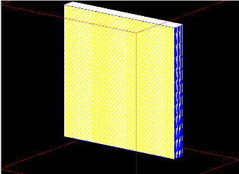
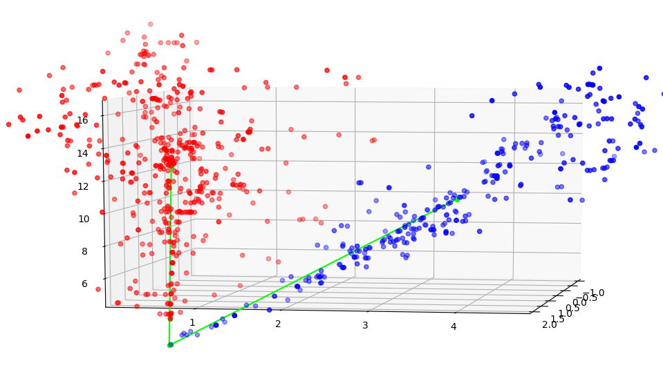
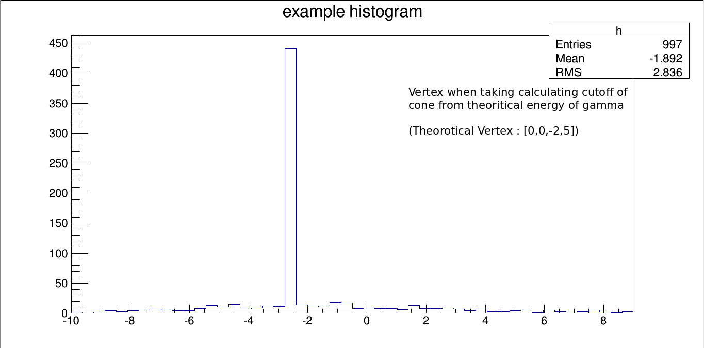
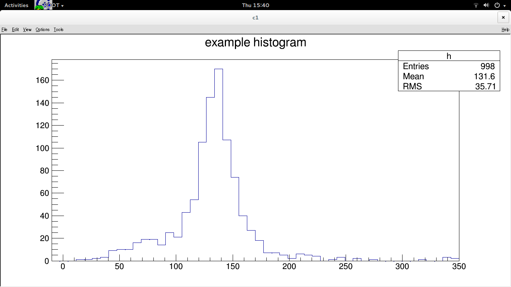

# Reconstruction of EM shower and π0 in ND Ecal

Neutrinos are abundant in nature, but it is very difficult to detect the neutrinos as
they are electrically neutral and they interact only via weak interactions. We aim
to observe the neutrino oscillation from muon type neutrino to electron type neutrino 
as it travels through matter.

We want to distinguish between a gamma shower due to neutral pion decay and an electron 
shower to determine the percentage of electron type neutrinos which already exist in the
source beam and the ones that are formed by neutrino oscillations. There are two major parts of 
this project. 
* Optimisation of the Detector geometry. 
* The reconstruction of EM showers and neutral pion decay.

The aim of this project is to investigate new methods based on statistics and machine
learning to determine the basic characteristics of π0 like its mass, position, separation
angle between both gamma particles, momentum, kinetic energy etc.

## The Detector 

The detector that we are using to study neutral pion decay is an electromagnetic calorimeter.

We aim to detect the muon type neutrinos content in the beam in the near detector which interacts with the detector nucleus to give neutral pion. To study the characteristics of the particles, the simulation of the real detector is
done using Geant4 software. The detector that we are using to study neutral pion
decay is made of consecutive alternating horizontaland vertical bars of plastic scintillator with lead plates in between them.

The simulated detector is made according to the known standard Electromagnetic
calorimeter which shows maximum efficiency in detection of particle’s hits data
(hits data is the data containing information about position, momentum, kinetic
energy etc of the particle). Each plate consists of 160 bars aligned in a particular 
direction with dimensions as 4m × 2.5cm × 1cm. Each lead plate is of dimension
4m × 4m × 1.75mm. Hence the overall dimension of Detector is 4m × 4m × 0.7m
The Scintillator material is used for detection of the pion as it absorbs the incoming
particles energy and re-emits as light which we measure and use for further analysis.
Lead Sheet is used for slowing down the particles so that it doesn’t escape the
detector.

## Reconstruction

The reconstruction algorithm is based on machine learning and pattern recognition. We have used various methods like hough transform, PCA, DBScan etc for reconstruction of the neutral pion decay. We are trying to get the vertex and angle of seperation between the two gamma showers.

This Image shows the two gamma showers after reconstruction and the line intersecting is the vertex.

## Results

From  the  Reconstruction  algorithm,  we  obtain  the  position  of  vertex,  separation angle between the two gamma showers and the invariant mass of pion. Here are some results for pion of energy 0.2, 0.5, 0.8, 1.2 GeV

Separation Angle of gamma showers for 0.2 GeV pion

Separation Angle of gamma showers for 0.5 GeV pion

Separation Angle of gamma showers for 0.8 GeV pion

Separation Angle of gamma showers for 1.2 GeV pion

Figure 5.2 and 5.3 shows the separation angle we get from the MC truth data for0.2  and  0.5  GeV  respectively.   This  is  calculated  but  considering  the  momentuminformation of the two initial gamma.

The Vertex plot.

The Pion Mass plot.

We calculate the separation angle for 4 energies and compare them with our recon-structed separation angle.  Fig 5.4, 5.5 shows the separation angle we get from theMC truth data for 0.8 and 1.2 GeV respectively.

The mean separation angle for pion kinetic energy as 0.2, 0.5, 0.8, 1.2 GeV is 60, 34,23, 16 degree respectively.
In Fig 5.6 to 5.9, the Reconstructed separation angle is shown for energies 0.2,0.5,0.8,1.2 GeV

The peak of the reconstructed separation angle of the two gamma showers are 29,31, 17, 13 for energies 0.2, 0.5, 0.8, 1.2 GeV. 
This shows that the algorithm fails for pions with very low energy such as 0.2 GeV.Fig 5.10 to 5.13 shows the position of vertex of the pion for energies 0.2,0.5,0.8, 1.2GeV. The pion generated by Mc has position of vertex at 0.0 cm

The Reconstructed position of vertex of the pion peaks near 3cm to 4cm for energyrange from 0.2 to 1.2 GeV. And the maximum deviation from the original vertexposition is around 20cm.The Fig 5.14 to 5.17 shows the invariant mass of the pion while the kinetic energyof the pion is 0.2, 0.5, 0.8, 1.2 GeV.

From figure 5.14 and 5.17 we can say that the algorithm doesn’t work very well forvery low or high energy pions.
