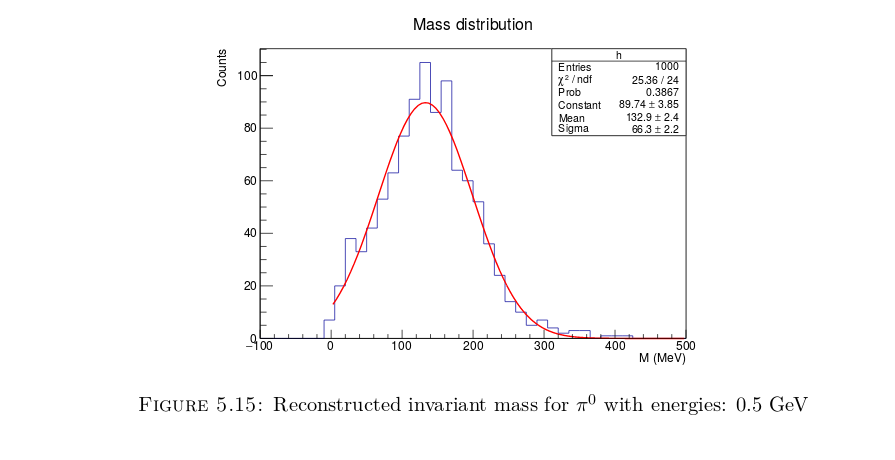
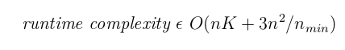
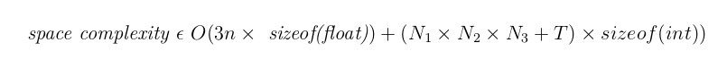

# Reconstruction of EM shower and π0 in ND Ecal

Neutrinos are abundant in nature, but it is very difficult to detect the neutrinos as
they are electrically neutral and they interact only via weak interactions. We aim
to observe the neutrino oscillation from muon type neutrino to electron type neutrino 
as it travels through matter.

We want to distinguish between a gamma shower due to neutral pion decay and an electron 
shower to determine the percentage of electron type neutrinos which already exist in the
source beam and the ones that are formed by neutrino oscillations. There are two major parts of 
this project. 
* Optimisation of the Detector geometry. 
* The reconstruction of EM showers and neutral pion decay.

The aim of this project is to investigate new methods based on statistics and machine
learning to determine the basic characteristics of π0 like its mass, position, separation
angle between both gamma particles, momentum, kinetic energy etc.

## Motivation
In 1957, Bruno Pontecorvo postulated neutrino oscillations and in 1960, after discovery of the second type of neutrino, he suggested that there is oscillation of muon type neutrino to electron type neutrino . Finally, oscillations of atmospheric neutrinos were evidently seen at the Super-Kamiokande experiment in 1998, which supported this postulate. It also showed that the deficit in atmospheric muon type neutrino depends on the neutrino path length and energy.
 
 In 2001, oscillations of solar neutrinos were discovered in the SNO experiment. The SNO collaboration published strong evidence for the flavour transformation of electron neutrinos into muon and tau neutrinos.
 
 In 2003, oscillations of reactor neutrinos were discovered in KamLAND with the disappearance of $\bar\nu_e$ for long neutrino path length. 
 
There were many more recent experiments that confirm Bruno's postulate. 
 
Neutral pion plays an important role in the study of neutrino oscillations. The muon type neutrino  oscillates to electron type neutrino as it moves through space. To observe these neutrino oscillations, we use an initial beam of muon type neutrino and observe its conversion to electron type neutrino by calculating the amount of electron and muon detected in the long baseline detector. 

As electromagnetic calorimeter gives information about energy deposition only, the gamma shower and electron shower from muon type neutrino to electron type neutrino oscillation are indistinguishable. Neutral pion decays predominantly into two gamma showers, thus it can be easily mistaken as two electron showers which will result in miscalculation of the neutrino oscillation.

## The Detector 

To study the characteristics of the particles, the simulation of the real detector is done using Geant4 software. The detector that we are using to study neutral pion decay is an electromagnetic calorimeter made of consecutive alternating horizontal and vertical bars of plastic scintillator with lead plates in between them.

Electromagnetic calorimeter detects particles by slowing and stopping them, hence there would be energy deposition during this process which is collected and measured. Electromagnetic calorimeter detects particles that interact via electromagnetic interactions for example charged particles like electrons and positrons.

The simulated detector is made according to the T2K Electromagnetic calorimeter which shows maximum efficiency in detection of particle's hits data (hits data is the data containing information about position, momentum, kinetic energy etc of the particle). Each plate consists of 160 bars aligned in a particular direction with dimensions as 4m × 2.5cm × 1cm. Each lead plate is of dimension 4m × 4m × 1.75mm. Hence the overall dimension of Detector is 4m × 4m × 0.7m

The Scintillator material is used for detection of the pion as it absorbs the incoming particles energy and re-emits as light which we measure and use for further analysis. Lead Sheet is used for slowing down the particles so that it doesn't escape the detector.

## Reconstruction

The reconstruction algorithm is based on machine learning and pattern recognition. 3D Iterative Hough transform is used to find the most poppulated lines in space, which determines the main path of the 2 gamma particles. After determining the lines, various clustering methods are used to seperate out the gamma particles whose total energy gives us the invariant mass of incoming particle. Hence we can determine if the incoming particle is a pion or not.

This Image shows the two gamma showers after reconstruction and the line intersecting is the vertex.

## Results

Here's a plot for the invarient mass of the pion for 500Mev:

The time complexity of the current algorithm is:

And the space complexity of the algorithm is:

